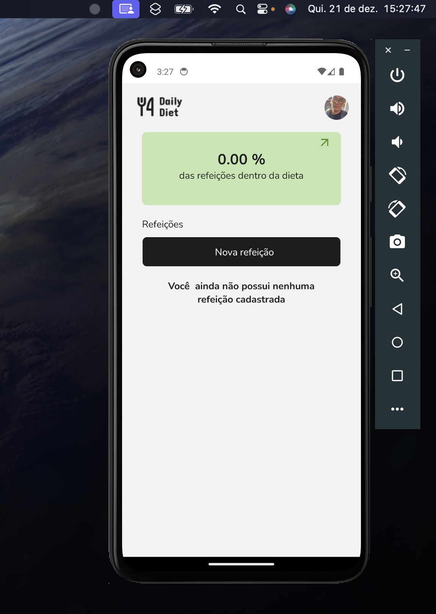
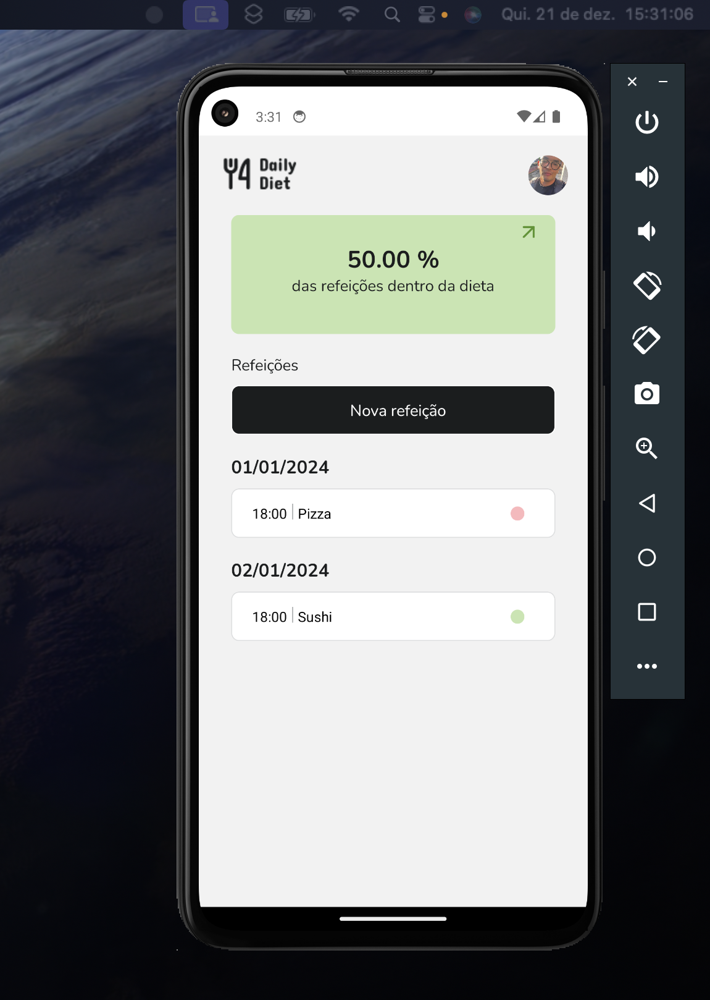
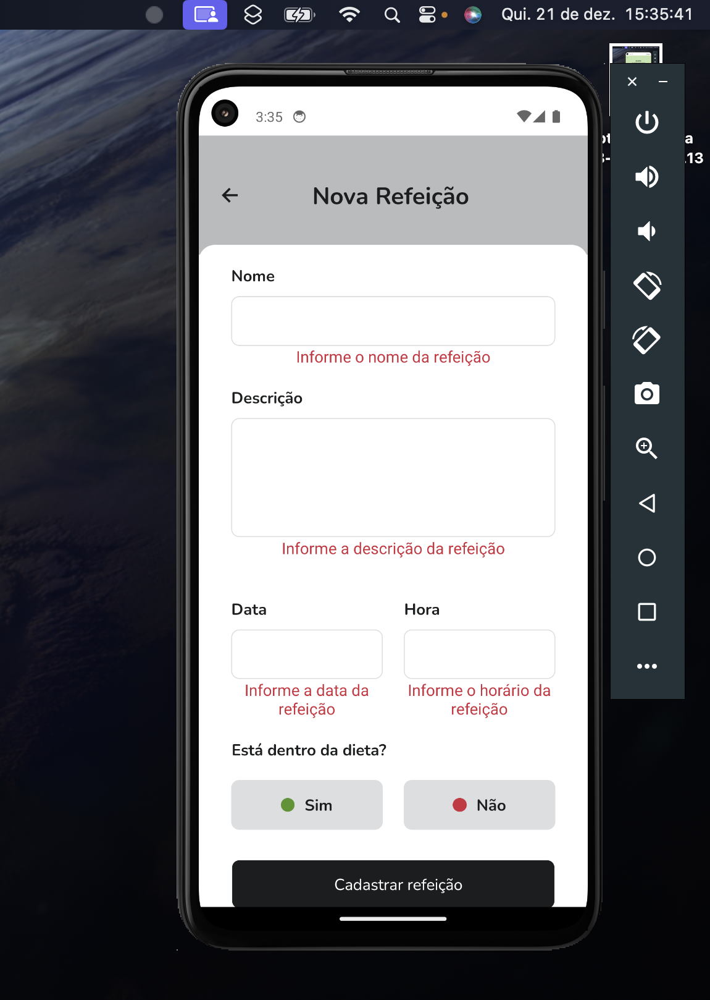

# 📸 Overview:





# 💻 Project:
## Aplicação Mobile que registra, edita e excluir refeições do dia a dia e as classifica se estão dentro ou fora da dieta.

# 🚀 Technologies:
### ✔️ Async-Storage
### ✔️ React-Native
### ✔️ React hook Form
### ✔️ Styled-Components
### ✔️ Typescript

# How to run

```
# Clone this repository
$ git clone https://github.com/vinnycosta9898/ignite-daily-diet-app

# Go to the directory
$ cd ignite-daily-diet-app

# Install Dependencies
$ npm install

# Run Web Server
$ npx expo start